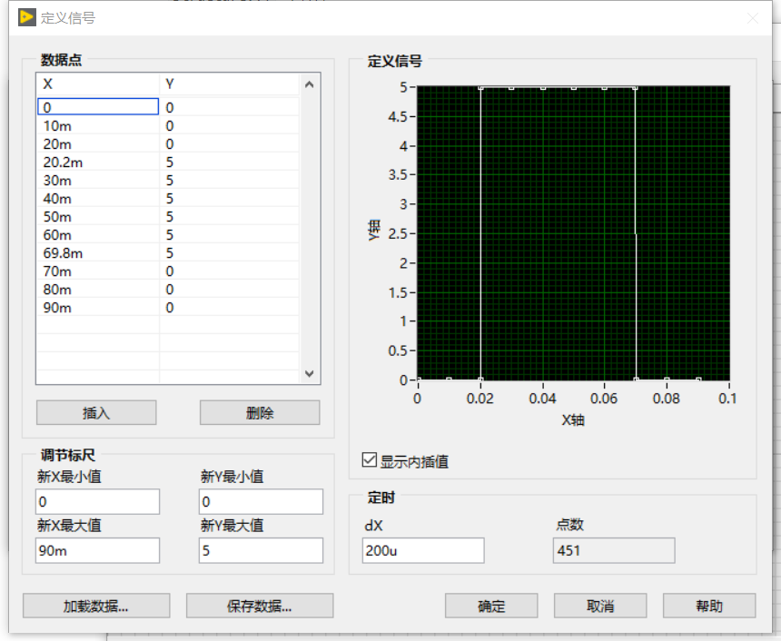
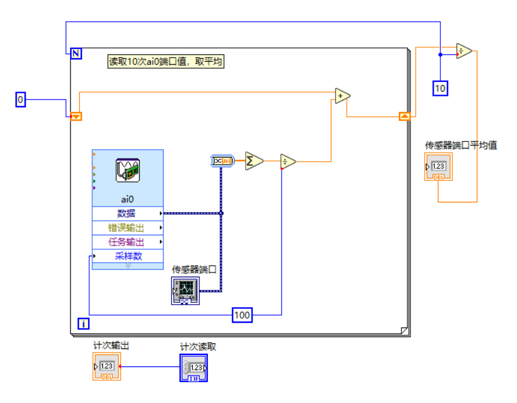
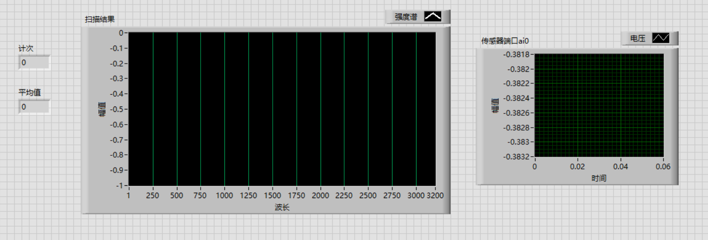
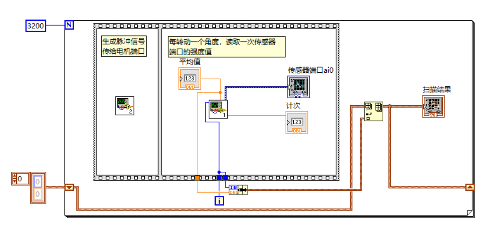

## 单色仪控制部分实现：

控制部分由以下三个``.vi``文件组成：

- ``structure.vi ``- 主程序
- ``motor.vi`` - 控制电机
- ``sensor.vi`` - 控制传感器

下面详细说明三个文件的组成及使用。

#### ``motor.vi``

无输入，输出一个单脉冲信号给DAQ assistant内建模块（该模块设置为信号输出，对应端口连接电机的PUL+端口）。脉冲信号波形如下图：

该vi主要作为`sub vi`被调用。

#### ``sensor.vi``

该模块同样调用了`DAQ assistant`，对应端口连接光电倍增管，可以读取传感器的模拟信号。目前该模块对信号的处理很简单——每次平均信号强度，并读取10次，再做一次平均，输出一个标量值。其具体结构如下：

同样是作为`sub vi`被调用。

#### ``structure.vi``

**前界面**

左侧实时绘制扫描中每个角度对应的光电倍增管强度值，右侧实时显示光电倍增管输入的信号。

**后界面**

主要都是在实现实时绘制功能（即扫描完一个角度绘制一个点，最后得到光谱曲线）。

#### 单色仪功能实现

我们最终把主程序做成了类似于一个`api`的形式，即输入完电机旋转方向及旋转 $\Delta\theta$ 多少次后（$\Delta\theta$ 即最小转角），点击开始按钮即开始扫描。这样便于组成最终版的控制程序。

目前设计的最终控制流程如下：

1. 打开总开关，进行第一次扫描，人工定标
2. 用户可以手动设置转动方向与测定波长区间，仪器自动转到相应位置并进行测量
3. 除了实时显示的波谱图外，数据文件被保存到`data.csv`中，用于后期数据处理